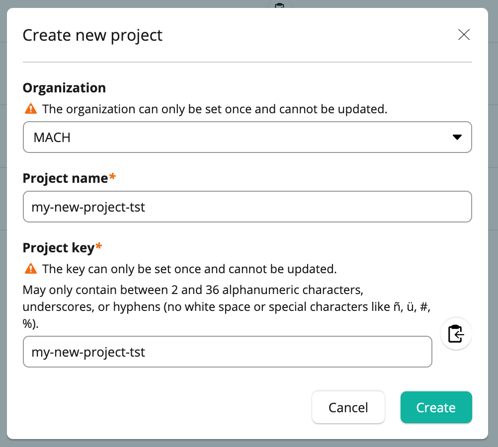
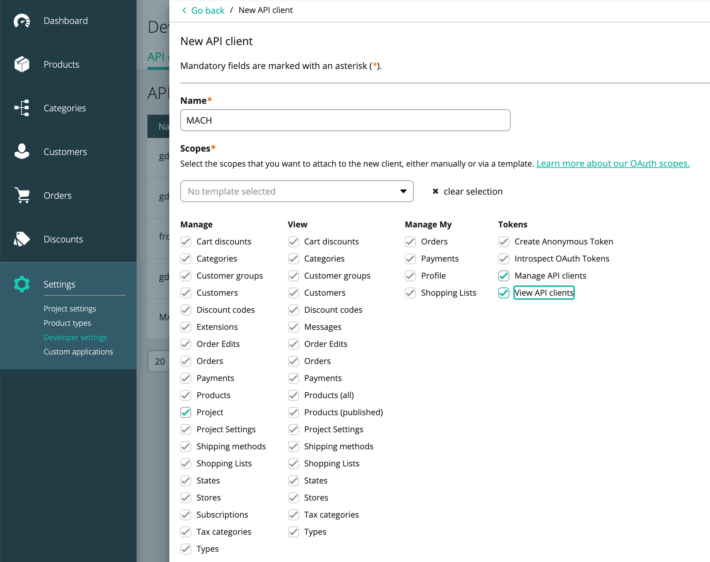

# Step 2. Setup commercetools

!!! info "Optional"
    This step is only necessary if you are going to use the commercetools integration in your MACH stack

## Create an account / login

Login in commercetools: [https://mc.europe-west1.gcp.commercetools.com/login](https://mc.europe-west1.gcp.commercetools.com/login)

If you don't have an account yet, you can [signup for a free trail](https://ok.commercetools.com/free-trial#start-free-trial-form)

!!! note "commercetools regions"
    By default MACH uses the `europe-west1` region of commercetools.

    There are [more regions available](https://docs.commercetools.com/api/general-concepts#hosts) that can be used.
    If any other then the default is used, make sure you change the [necessary commercetools settings](../reference/syntax/sites.md#commercetools) in your MACH configuration later on.

## Create a new project

Create a new project in the commercetools Merchant Center

{: style="max-width: 500px"}

## Create API client

Go to `Settings` > `Developer Settings` and create a new API client which we will name **`MACH`**

Required scopes:

- `manage_api_clients`
- `manage_project`
- `view_api_clients`

!!! info "One client to rule them all"
    This client is used the MACH composer to create other necessary commercetools clients for each individual component.

We will use these credentials later when configuring our MACH stack.

{: style="max-width: 800px"}

!!! tip "Next: step 3"
    Next we'll setup our cloud environment:

    - [AWS](./aws/step-3-setup-aws-services.md)
    - [Azure](./azure/step-3-setup-azure.md)